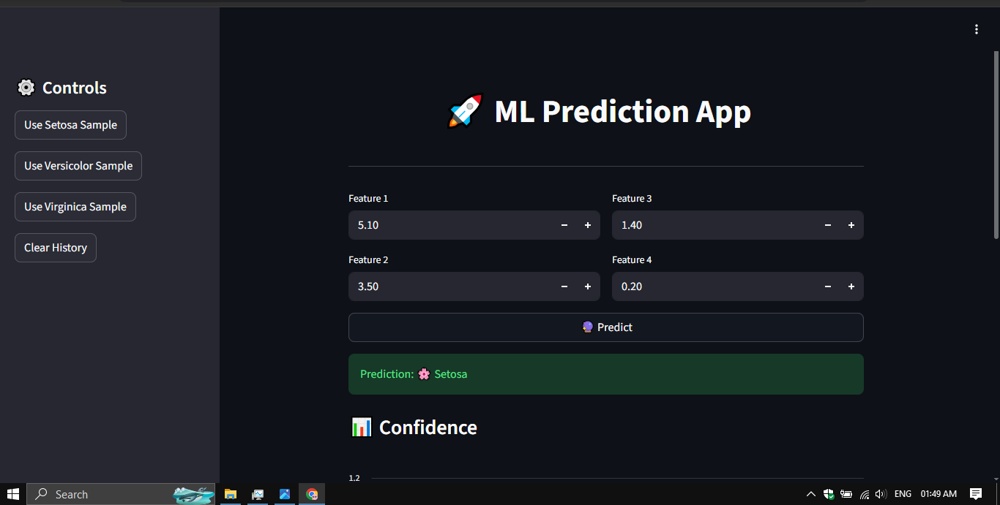
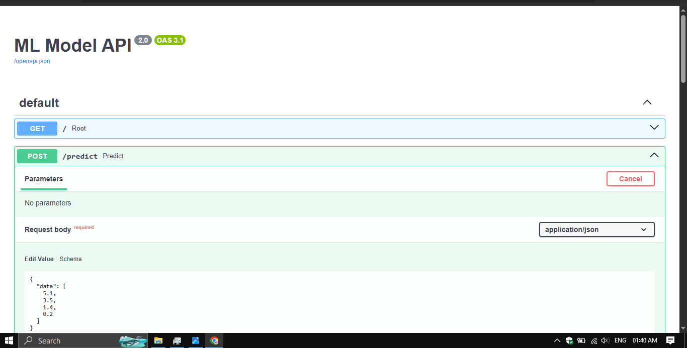
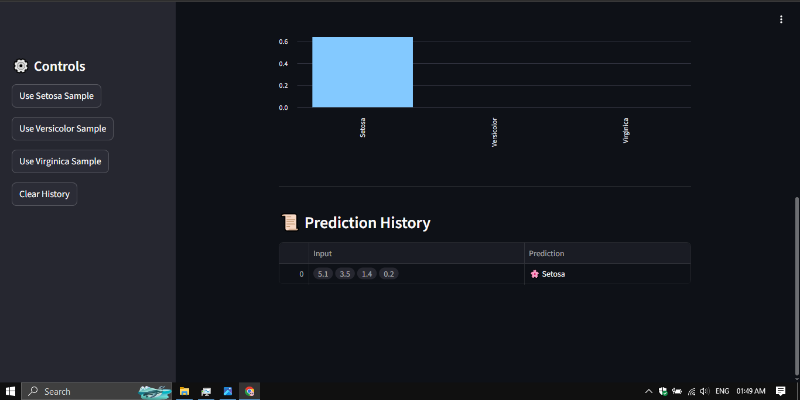
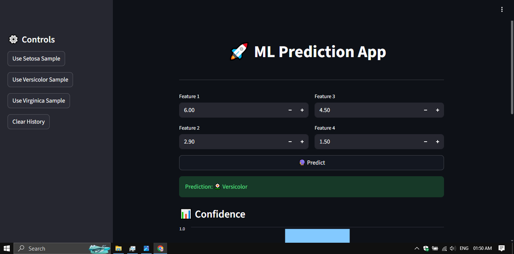
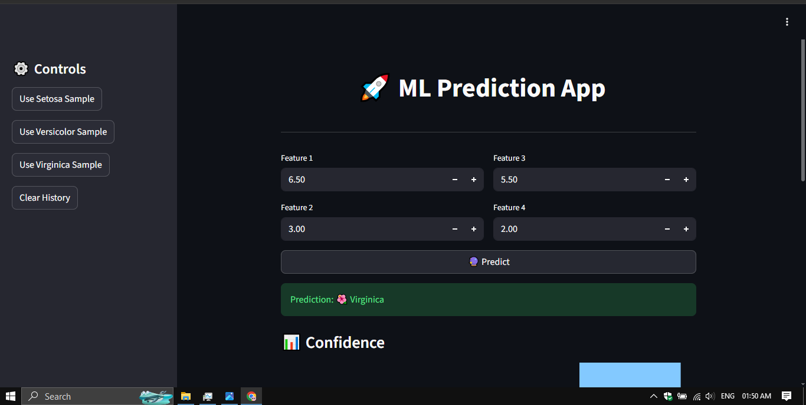
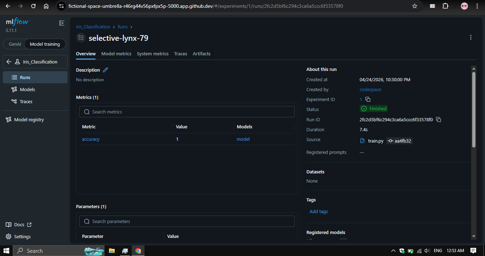
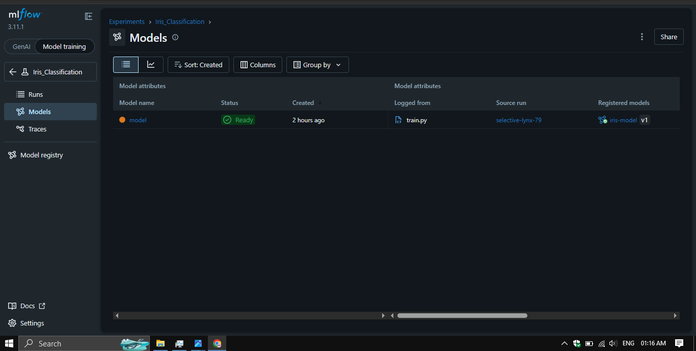
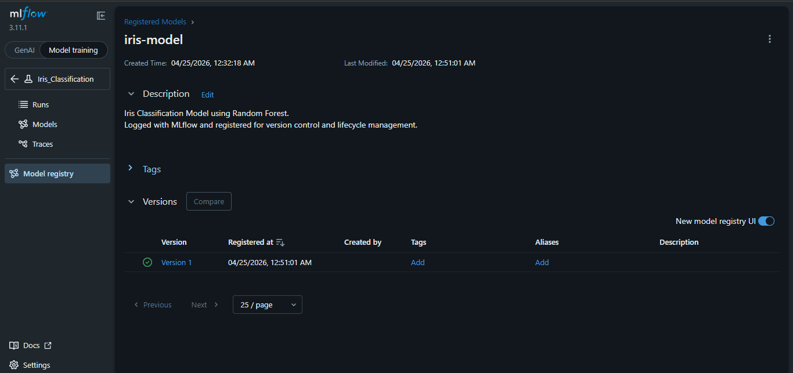

# 🚀 ML Production App (FastAPI + Streamlit + MLflow + Docker)

## 📌 Overview

This project demonstrates an **end-to-end Machine Learning system** that includes model training, API deployment, interactive frontend UI, and experiment tracking.

The system is built using:

* **FastAPI** → Backend API
* **Streamlit** → Frontend UI
* **MLflow** → Experiment tracking
* **Docker** → Containerization

👉 It simulates a **real-world production ML workflow**.

---

## ⚙️ Features

* ✅ Train ML model using Scikit-learn
* ✅ Deploy model with FastAPI REST API
* ✅ Interactive UI using Streamlit
* ✅ Real-time predictions with user input
* ✅ Confidence score visualization 📊
* ✅ Prediction history tracking 📜
* ✅ MLflow experiment tracking & logging
* ✅ Swagger UI for API testing
* ✅ Docker containerization
* ✅ Clean and modular architecture

---

## 🧠 Machine Learning Model

* Dataset: **Iris Dataset**
* Algorithm: **Random Forest Classifier**
* Library: Scikit-learn
* Accuracy: ~1.0

---

## 🏗️ System Architecture

```
User (Streamlit UI)
        ↓
FastAPI Backend (/predict)
        ↓
ML Model (joblib)
        ↓
Response (Prediction + Confidence)
        ↓
UI Display + Chart + History
        ↓
MLflow logs experiment
```

---

## 📁 Project Structure

```
ML-Production-App/
│
├── app.py              # Streamlit UI
├── main.py             # FastAPI backend
├── train.py            # Model training
├── model.joblib        # Trained model
├── mlruns/             # MLflow experiments
├── screenshots/        # Project screenshots
├── requirements.txt    # Dependencies
├── Dockerfile          # Docker setup
├── .gitignore
└── README.md
```

---

## ▶️ Run Locally

### 1️⃣ Install dependencies

```
pip install -r requirements.txt
```

---

### 2️⃣ Run FastAPI Backend

```
uvicorn main:app --host 0.0.0.0 --port 8000
```

👉 Open:

```
http://localhost:8000/docs
```

---

### 3️⃣ Run Streamlit UI

```
streamlit run app.py
```

👉 Open:

```
http://localhost:8501
```

---

### 4️⃣ Run MLflow UI

```
mlflow ui --port 5000
```

👉 Open:

```
http://localhost:5000
```

---

## 🔗 API Endpoints

### 🔹 GET /

Check API status

```
{
  "message": "ML API is running successfully"
}
```

---

### 🔹 POST /predict

**Request:**

```
{
  "data": [5.1, 3.5, 1.4, 0.2]
}
```

**Response:**

```
{
  "input": [5.1, 3.5, 1.4, 0.2],
  "prediction": [0],
  "confidence": [[0.98, 0.01, 0.01]]
}
```

---

## 🎨 Streamlit UI Features

* 🔘 Feature input sliders
* ⚡ Instant prediction
* 📊 Confidence bar chart
* 📜 Prediction history
* 🎯 Sample input buttons (Setosa / Versicolor / Virginica)

---

## 🐳 Run with Docker

### Build image

```
docker build -t ml-production-app .
```

### Run container

```
docker run -p 8000:8000 ml-production-app
```

---

## 📸 Screenshots

## 📸 Screenshots

### 🔹 Streamlit UI


### 🔹 API Documentation


### 🔹 Prediction Examples




### 🔹 MLflow Runs


### 🔹 MLflow Model


### 🔹 Model Registry


---

## 📖 Tech Stack

* Python
* FastAPI
* Streamlit
* Scikit-learn
* MLflow
* Docker
* Uvicorn
* Requests

---

## 💡 Key Concepts

* End-to-End ML Pipeline
* Model Deployment (FastAPI)
* Frontend Integration (Streamlit)
* Experiment Tracking (MLflow)
* Containerization (Docker)
* REST API Design

---

## 🎤 Project Highlights

👉 This project demonstrates:

* Full ML lifecycle (train → deploy → monitor)
* Production-style architecture
* Interactive user interface
* Real-time inference system

---

## 👨‍💻 Author

**Niam**
AI Engineering Student

---

## ⭐ Conclusion

This project represents a **complete production-ready ML system**, combining backend, frontend, and experiment tracking tools.

It showcases how machine learning models can be deployed, monitored, and used interactively in real-world applications.

---
